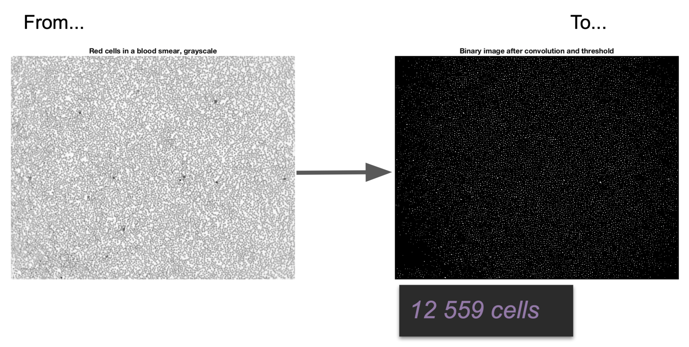

# Cells counting

Counting red blood cells in blood smear.

## Goal of the project

The goal of this project is to count the number of blood cells in a 2D image
of a blood smear.

## Steps
I use several steps of image pre-processing to obtain a binary image from which it is
easy to count the cells by counting the white zones in the image.

### Most effective method
The most accurate method I found is a _pattern matching approach_.

1. I take a reference cell, and compute its convolution against the complete image.
 Higher intensity zones corresponds to cells center.

2. Then, I apply a threshold at a given percentage of the histogram to get a binary image where the cells
are white circles and the rest is black.

3. Finally, I count the white zones in the binary image.

## Notes
This project was part of my Master Of Science curriculum at Centrale Nantes.

This project is no longer updated.
